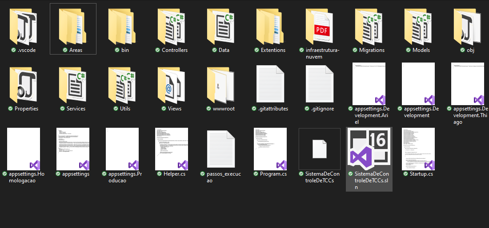

<p align="center">
   
</p>

<h3 align="center">
  Controle de TCC
</h3>

<p align="center">
 

  <a aria-label="Last Commit" href="https://github.com/jislane/ControleDeTccs/commits/master">
    
</p>
<p align="center">
  <a target="_blank" href="https://docs.microsoft.com/pt-br/dotnet/csharp/">
    
  </a>
  <a target="_blank" href="https://dotnet.microsoft.com">
    
    </a>
</p>

## 👨‍💻 Instalação

Para que todo ambiente funciona de forma certa seguir seguintes regas:

1. Instalar o [Net Core 3.1 SDK](https://dotnet.microsoft.com/download/dotnet-core/thank-you/sdk-3.1.102-windows-x64-installer)
2. Instalar o [Visual Studio Community](https://visualstudio.microsoft.com/pt-br/vs/community/)
3. Reiniciar o PC
4. Instalar [SQL Server Express](https://go.microsoft.com/fwlink/?linkid=866658)
5. Instalar [Manager SQLServer (SSMS)](https://docs.microsoft.com/pt-br/sql/ssms/download-sql-server-management-studio-ssms?view=sql-server-ver15) obs: se vc instalar SQL server PT-BR vc tem que instalar Manager PT-BR, se instalar Inglês o Manager deve ser Inglês
6. Ativar o variável global do Entity Framewark, execute esse comando na CMD ou Power Shell: dotnet `tool install --global dotnet-ef`
7. Reinicar PC (os comandos “`dotnet ef`” so funcionam após reiniciar o PC) Comandos de migração “Todos devem ser executados dentro da pasta projeto” `dotnet ef migrations add InitialCreate` `dotnet ef database update`

## 🏃 Começando

- Clone o repositório
  `git clone https://github.com/jislane/ControleDeTccs `
  Indicado que antes faça o fork para e após o fork realizar o clonet com o link do seu repositório

- Abrir arquivo no Visual Studio
  

- Procure a string de conexão do SQL Server na máquina [Como criar Connection Strings consistentes para SQL Server](https://youtu.be/fZnEVPdjcic)

- Em appsettings.json no projeto comente em `ConnectionStrings` a atual e coloque a sua:

```
    "SistemaDeControleDeTCCsContextConnection": "Integrated Security=SSPI;Persist Security Info=False;User ID=__SEU_USER__;Initial Catalog=SistemaDeControleDeTCCs;Data Source=__SUA_DATA_SOURCE__"
```

- No terminal do Visual Studio executei os comandos:

`dotnet ef migrations add InitialCreate`
`dotnet ef database update`

- Run

## 📝 Manual do Sistema

- Manual do Aluno
  <a href=".github/Manual_Aluno.pdf">Download PDF</a>
- Manual do Administrador/Coordenador/Professor
  <a href=".github/Manual_Admin_e_outros.pdf">Download PDF</a>
